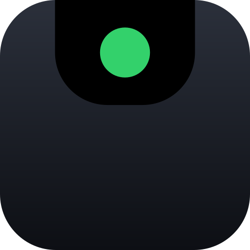

<p align="center">
  
</p>

# Runway

GitHub Actions runs, live in the macOS notch.

The island shows up when a workflow starts, tracks it job by job, and disappears
when it's done. Hover for the full breakdown, click to open the run on GitHub.

When a deploy stops and waits for a human, it turns amber and stays — and if
GitHub says *you* are the one who can approve it, you get a banner. Nobody else
does. [Approvals](#approvals) explains why that distinction is the whole
feature.

On a display without a notch it sits under the menu bar instead, as a pill.

macOS 14+, Swift 6, no third-party dependencies.

## Whose runs

The setting the rest of the app is built around. Being in a company's org does
not mean you want every colleague's push in your menu bar — but it also doesn't
mean you only want your own. Three options:

| Option | What you get |
|---|---|
| **Only my runs** | Your pushes, and anything you re-ran. The default. |
| **Everyone's runs** | Every run in the watched repositories. |
| **Specific people** | A list you pick. `@me` resolves to whoever the token belongs to. |

A re-run counts for **both** people: GitHub records the person who pushed as
`actor` and the person who clicked *Re-run* as `triggering_actor`, and Runway
matches either. So if you re-run a colleague's failed deploy, it shows up in
your island — which is what you want, since you are now the one waiting on it.

Filtering happens locally, from the 30 most recent runs in each repository.
GitHub does offer an `?actor=` parameter, and Runway deliberately doesn't use
it: measured against the live API it matches the *push author* rather than the
run's actor, so it cannot see a run somebody else pushed and you re-ran — the
exact case above, under the default setting. It also saves nothing, since
`per_page` 10 and 100 cost the same single request. [`docs/actors.md`](docs/actors.md)
has the measurements.

## Install

```bash
brew tap Federico-Baldan/runway https://github.com/Federico-Baldan/runway
brew install Federico-Baldan/runway/runway
```

This repository is its own Homebrew tap — there is no separate `homebrew-tap`
repo. Homebrew reads formulae from a tap's `Formula/` directory, and `brew tap`
accepts an explicit URL for repositories not named `homebrew-*`. The `tap` line
is a one-off; after that `brew upgrade` works normally.

No Xcode required: the app is built by CI and Homebrew unpacks it.

A **formula** shipping a prebuilt app, not a cask, and that is deliberate. The
app is ad-hoc signed but not notarized, because notarizing needs a $99/year
Apple Developer ID. Gatekeeper only asks about notarization for a file carrying
`com.apple.quarantine` — and quarantine is applied by the *cask* installer, not
by formulae. So a cask of this app would send you to System Settings → Privacy
& Security → Open Anyway on first launch, and the formula does not.

The same reasoning means you should **not** grab `Runway.zip` from the releases
page and unzip it yourself: a browser download is quarantined and will hit that
wall. Install through brew.

The one thing a Developer ID would buy: an ad-hoc signature is pinned to the
binary's cdhash, which changes every build, so macOS treats each upgrade as a
new app and asks for keychain access again to reach your token. Compiling
locally had the same problem — it is the price of not paying Apple $99.

Or from source, without Homebrew (this is the path that needs Xcode 16+):

```bash
git clone https://github.com/Federico-Baldan/runway
cd runway
make signing-identity   # once, stops repeated keychain prompts (not with sudo)
make app
open .build/debug/Runway.app
```

## The token

Click the menu bar icon, open Settings, and paste a **fine-grained** personal
access token with:

| Permission | Level | Why |
|---|---|---|
| Actions | Read | `/actions/runs`, `/actions/runs/{id}/jobs`, `/actions/runs/{id}/pending_deployments` |
| Metadata | Read | Mandatory on every fine-grained token; granted automatically |

**Actions: Read is the only box you tick.** All three repository endpoints
Runway calls sit under it — including the approval check, which is why knowing
that a deploy is waiting on you costs nothing extra on the token. Runway never
reads your code, so Contents is not needed. Everything it does is a `GET`.

What matters more than the permission is the **repository selection**: a
fine-grained token only reaches the repositories you explicitly pick when
creating it. Runway can watch nothing else, whatever the permissions say.

There's a button in Settings that opens the token page.

Your token goes in the macOS Keychain, never to disk. The app asks for keychain
access on first launch; that prompt is the whole point.

You can also provision it headlessly:

```bash
runway store github_pat_...
runway verify
```

## If you are inside an organization

This is where GitHub gets genuinely confusing, and where a token that
authenticates perfectly can still show you nothing. There is no single right
answer — it depends on what your org has turned on — so here is the whole
decision, with the failure mode each option has.

### Which token to create

| Your situation | Create | Then |
|---|---|---|
| Only your own repositories | Fine-grained, resource owner = **your account** | Nothing. Pick the repos, tick Actions: Read. |
| Org repositories, org allows fine-grained tokens | Fine-grained, resource owner = **the organization** | It may sit **pending** until an owner approves it. Until then it is inert — no error, just nothing. |
| Org requires approval and nobody is approving | Classic with `repo` | Works immediately. Grants far more than Runway uses; see below. |
| Org enforces **SAML SSO**, classic token | Classic with `repo` + `read:org` | Open the token → **Configure SSO → Authorize** for each org. Not optional, and not obvious. |
| Org has never enabled fine-grained tokens | Classic with `repo` + `read:org` | Fine-grained tokens are opt-in per organization; if it is off, only classic can reach it. |
| GitHub Enterprise Server | Whatever your instance supports | Set the Host field (or `RUNWAY_HOST`) to `https://github.example.com`. Runway appends `/api/v3` itself. |

`read:org` (classic) or **Organization → Members: Read** (fine-grained) is what
populates the organization picker in Settings. It is not needed to watch runs —
only to *list* the organizations you could pick from.

### Fine-grained or classic?

Prefer fine-grained. A classic token with `repo` grants read **and write** to
code, issues, releases and settings on every repository you can reach; Runway
uses two read endpoints. If your org's policy makes classic the only thing that
works, that is a policy conversation worth having, not a reason to hand a
CI-status app write access forever. Give a classic token an expiry.

### The four ways this fails silently

GitHub reports none of these as an error, which is why Runway goes out of its
way to say them out loud:

1. **SAML, classic token, not authorized.** `/user/repos` and `/user/orgs`
   return **`200 OK`** with that organization's rows quietly removed. The only
   trace is an `X-GitHub-SSO: partial-results` header. Runway reads it and puts
   the reason on the island and in Settings, with the authorize link.
2. **SAML, single-org request.** `/orgs/{org}/repos` returns `403` with
   `X-GitHub-SSO: required` and a one-hour authorization URL. Runway surfaces
   the link; if it has gone stale, hit Recheck.
3. **Fine-grained token pointed at the wrong owner.** Created against your
   personal account it can *never* see an organization, whatever its
   permissions. There is no error — the list is simply empty. Settings says so
   rather than showing you a blank picker.
4. **Fine-grained token still pending approval.** Same symptom, different cause:
   an org owner has to approve it under Settings → Personal access tokens.
   Until they do, it authenticates and sees nothing.

A classic token that is not SSO-authorized can also produce a plain **404** on a
specific repository, which is indistinguishable from a repository that was
renamed or deleted. Runway demotes that repository and carries on — so if one
repo is missing and the rest work, check the SSO authorization on the token
before assuming the app is broken.

### What an organization owner has to do

For a colleague's fine-grained token to work against your org:

- **Settings → Personal access tokens → Fine-grained tokens**: allow access
  (it is off by default in many orgs), and decide whether each token needs
  approval.
- If approval is required, requests land in **Settings → Personal access tokens
  → Pending requests**. Nothing tells the person waiting; the token just does
  nothing.
- If the org enforces SAML SSO, tell people the *classic* path needs
  **Configure SSO → Authorize** after the token is created, per organization.

None of this gives Runway any access to your code. The permission it asks for
reads workflow-run metadata, and nothing else.

## Which repositories

GitHub has no endpoint for "every run I can see". Its API is per-repository, so
Runway has to pick a set and poll each one — which is the main structural
difference from the GitLab project this is a port of, where a single query
answered the whole question.

**Recently active** (the default) asks GitHub for your repositories sorted by
last push and takes the top 20. That covers the real case — you are working in
two or three repos — without spending a request per cycle on the long tail.

| Option | What you get |
|---|---|
| **Recently active** | Your most recently pushed repositories, whoever owns them. The default. |
| **I contribute to** | Where you are a collaborator or an org member, with your own repositories left out. |
| **My repositories only** | Repositories your account owns, personal ones included. |
| **Selected organizations** | Everything under the orgs you tick. |
| **A list I choose** | Exactly the `owner/repo` entries you type. Nothing is discovered. |

**Repositories I contribute to** is the setting for working inside a company.
Being in an org means the default sweeps up your side projects alongside the
one repo you are on call for, and "my repositories only" is the opposite
mistake. It resolves to GitHub's own `affiliation=collaborator,organization_member`,
so the exclusion happens server-side: the repositories you own are never
fetched, rather than fetched and then filtered out. That matters for the ones
you own privately, which a client-side test would have paid a request to
discover and then thrown away.

The count is a dial in Settings. It is the one knob that trades responsiveness
for API budget.

### Why the polling is affordable

Twenty repositories polled every five seconds is 14,400 requests an hour against
a budget of 5,000. Runway sends every request with an `If-None-Match` header, and
GitHub does not charge a `304 Not Modified` against the primary rate limit when
the request is authenticated. A repository that isn't building doesn't change,
so it answers 304 and costs nothing. In practice only the repository that is
actually building is billed.

Three other things keep it down: repositories with no Actions at all get demoted
to an occasional check after the first empty response, the repository list itself
is only re-discovered every five minutes, and job detail — a second request per
run — is fetched only for runs that are moving or finished in the last two
minutes, since those are the only ones the island draws.

The approval check is a third request, and it is gated harder still: it is only
sent for a run that has already reported it is waiting, so on a normal poll it
is not sent at all.

`spike/RateBudgetVerify.swift` checks the arithmetic still holds.

## Approvals

The one thing in CI that is genuinely waiting on **you**.

A deployment job pointed at an environment with required reviewers does not
fail, does not retry, and does not move for thirty days — after which GitHub
cancels it. Nothing about that state is loud. It reports `status: "waiting"`,
which reads like "queued" to anything that does not look closer, and the run
sits at the top of the Actions tab looking busy.

Runway draws it in **amber**, pins it to the island so it cannot age out like a
finished run, and names the environment: `production — waiting for @alice`. Two
different GitHub mechanisms land here and they look nothing alike in the API:

| What happened | The API says | Runway shows |
|---|---|---|
| Deploy job hit an environment with required reviewers | `status: "waiting"` | amber, with the environment name and who can approve |
| First-time contributor's pull request needs a maintainer | `conclusion: "action_required"` | amber, "waiting for approval" — GitHub exposes no reviewer list for this one |
| Environment has a wait timer running | `status: "waiting"`, `wait_timer` set | amber; this one *will* move on its own |

### Who gets a notification

Only the person who can actually unblock it.

GitHub answers this directly: `/actions/runs/{id}/pending_deployments` returns
`current_user_can_approve` for the account the token belongs to. Runway sends a
Notification Centre banner **only** when that is true. A colleague's deploy
reaching production shows on the island in amber and is never sent to
Notification Centre — because an app that notifies fifty people every time
somebody deploys is an app that gets muted in a week.

That decision is one pure function, and `spike/ApprovalVerify.swift` pins it
against real payloads so it cannot drift.

The banner opens the run on GitHub. **Runway will not approve anything for
you**, and that is deliberate: *reading* pending deployments is Actions: Read,
the permission it already has, but *granting* one is a `POST` under Deployments:
write. Asking for that would mean asking every user for a token that can deploy,
to save one click.

Turn it off in Settings → Alerts, or with `RUNWAY_NOTIFY_APPROVALS=0`.

### It does not overrule "whose runs"

**"Only my runs" means only your runs**, approvals included. Earlier versions
let a colleague's deploy back onto the island whenever GitHub said you could
approve it, on the theory that a run parked on your review is your problem now.
Inside an organization that theory collapses: environments are usually guarded
by a *team*, and if you are in that team GitHub answers
`current_user_can_approve: true` for everybody's deploy — so the one setting
that promised a quiet island delivered the whole company's pipelines instead.

If you want that behaviour, it is still there: **Settings → Whose runs → "Let
deploys waiting on my approval through anyway"**, or
`RUNWAY_APPROVALS_FROM_OTHERS=1`. It is off unless you ask for it, and it has no
effect on "Everyone's runs", where nothing was being hidden to begin with.

### A deploy you rejected is not a failure

GitHub disagrees. Turn down a deployment as a required reviewer and the run is
reported as `conclusion: "failure"` — the same field, the same value, as a
build that fell over — so Runway drew a red cross at the person who had just
clicked *Reject* thirty seconds earlier, about their own decision.

The truth is one endpoint away. `/actions/runs/{id}/approvals` records the same
event as `state: "rejected"`, with the reviewer and whatever they typed in the
box, and GitHub lists it under the **Actions: Read** permission Runway already
has. So a run whose gate was turned down is drawn as its own state: a **grey
hollow cross**, not a red disc, settled next to *cancelled* and *skipped* where
finished-and-nobody's-problem belongs. Expanded, the row says who:

```
acme/infra #71   production      @you rejected the deploy to production — "not on a Friday"
```

It costs one request, once, per run — never per poll. Asked only about a run
that is red **and** carries the shape a rejection leaves behind: a job that
failed with no steps under it at all, because nothing in it ever ran. Anything
that failed with steps behind it broke for its own reasons and stays red, which
matters more than it sounds: the endpoint is keyed on the run id rather than the
attempt, so a deploy rejected on attempt 1 and re-run into a real Terraform
failure on attempt 2 still answers `rejected`. `spike/RejectionVerify.swift`
pins that case and every other shape that must not be relabelled.

### Taking a run off the island

Hover any run and click the **×** on the right. It goes away and stays away
across relaunches.

Local, and only local: nothing is sent to GitHub, nothing is deleted there, and
the token never needed write access to do it — the same reason Runway shows you
an approval and sends you to GitHub to grant it. A dismissal is keyed to the run
*attempt*, so re-running something you hid brings the new attempt back, which is
usually what you want: the thing you dismissed was a result, and a re-run is a
different result. Each one is forgotten by itself after a fortnight, and
**Settings → Where to show the island → "Show them again"** brings back the lot.

### What it costs

Nothing on a normal poll. The pending-deployments request is only ever sent for
a run that has already said it is waiting — see `RunMonitor.shouldFetchApprovals`
— so a repository where nothing is blocked never pays for it. The review-history
request is rarer still, and is cached for the life of the run: a finished run's
reviews cannot change, so it is asked once or not at all.

## Prod, staging or test

Two runs of the same workflow in the same repository look identical on an island
that only draws status — and one of them is going to production.

So a run that is deploying somewhere carries the name of where, in a colour that
is deliberately none of the status colours: violet for production, teal for
staging, grey for anything that cannot hurt you. What the chip looks like says
how much to trust it.

| Chip | Means |
|---|---|
| **Filled** | GitHub named the environment. The run is parked on a deployment gate and `pending_deployments` said so. |
| **Outlined** | Runway read a name — a job, a step, the workflow file, the branch — and drew a conclusion. The tooltip says which. |

That distinction is the whole design, because **GitHub does not put an
environment on a workflow run.** It names one in exactly one place,
`pending_deployments`, and only for a run waiting on a required reviewer. Every
deploy that is *allowed* to proceed goes past without the API ever saying where
it went, so everything else is read off the names people chose — and a status
app that draws a guess and a fact identically is one you stop trusting the first
time it is wrong about production.

The reading is conservative on purpose, because the expensive failure is not a
missing chip:

- **Whole words, never substrings.** A job called `product-api` is not a
  production deploy. Neither is a workflow called `Reproduction cases`.
- **`preprod`, `PreProd` and `PreProdDeploy` are staging.** Reading the
  rehearsal as the real thing is the one mistake here with a cost attached.
- **Ambiguous words need a deploy verb.** `test`, `dev`, `preview` and `stage`
  only count when something is being shipped in the same name. Every repository
  on earth has a job called `test`; a chip on every CI run would make the label
  worth nothing.
- **Step names need a verb whatever the word**, because `Build production
  bundle` is a step in half the JavaScript repositories on GitHub and deploys
  nothing.
- **When a run touches two, the one with the most to lose wins.**

None of it costs a request — it reads the payload the island already has.
[`docs/environments.md`](docs/environments.md) has the endpoints that were
considered and rejected and why, and `spike/EnvironmentVerify.swift` pins every
rule above, traps included.

## Environment variables

Handy for setting the filter per project or from a dotfile, without opening
Settings.

| Variable | Example |
|---|---|
| `RUNWAY_ACTOR_MODE` | `me`, `everyone`, `list` |
| `RUNWAY_ACTORS` | `@me,alice,bob` |
| `RUNWAY_REPO_SCOPE` | `recent`, `contributor`, `mine`, `organizations`, `explicit` |
| `RUNWAY_REPOS` | `acme/web,acme/api` |
| `RUNWAY_REPO_LIMIT` | `10` |
| `RUNWAY_ORGS` | `acme,acme-labs` |
| `RUNWAY_HOST` | `https://github.example.com` (Enterprise Server) |
| `RUNWAY_NOTIFY_APPROVALS` | `0` / `1` — banners when a deploy needs *your* approval |
| `RUNWAY_APPROVALS_FROM_OTHERS` | `0` / `1` — let a colleague's deploy past the "whose runs" filter when it needs *your* approval (default `0`) |

**They are defaults, not locks.** A variable supplies the starting value for a
setting you have never touched. The moment you change that setting in the app,
your choice wins and the variable stops applying to it — every control stays
editable. Settings shows a small `RUNWAY_ACTORS` chip next to any setting a
variable seeded, and clicking it puts the setting back to the variable's value.

An earlier version let the environment win permanently and greyed the controls
out. That was the wrong call: a forgotten variable in a shell profile left you
unable to change your own settings from inside the app, with no way to fix it
from inside the app either.

Setting `RUNWAY_ACTORS` without `RUNWAY_ACTOR_MODE` implies `list`, and
`RUNWAY_REPOS` without `RUNWAY_REPO_SCOPE` implies `explicit` — otherwise the
list would be stored and then quietly ignored. Both only apply while you have
not chosen the mode yourself.

One practical note: an `LSUIElement` app launched from Finder or as a login item
does not inherit your shell environment, so these take effect when Runway starts
from a terminal (`make run`) or a launch agent. Since they only seed first-run
defaults, that matters much less than it would if they were overrides.

## Other settings

**Which display** — the options are labelled with your actual monitors.

**Haptics** — a tap when something starts, passes, or fails. Needs a Force Touch
trackpad; Settings says so plainly if you don't have one.

**Approval banners** — see [Approvals](#approvals). Runway does not ask for
notification permission at launch; it asks the first time something is actually
waiting on you, because a permission prompt with nothing behind it gets denied.
Settings shows what macOS currently allows and links straight to the right pane
if you said no and changed your mind.

**The mark in the notch** — with nothing running, a notched Mac keeps a band of
island under the cutout with the Runway mark sitting in it, blinking every so
often and looking around. The band is *blended* into the housing rather than
hung off it: concave shoulders where it meets the menu bar, convex corners at
the bottom, so the union of hardware and pixels reads as one object. Hover it
and it looks back. Left, centre or right in Settings, since the band is the
cutout's width and that is a lot of room for one small mark.

The eye moves in saccades — abrupt 45-70ms jumps, a fixation between each, and a
blink on the way home, because that is what a real gaze shift does and a springy
eye is the one thing that reads as unmistakably fake. It is notch-only: off a
cutout the resting island is a floating pill under the menu bar, and a pill that
never leaves is furniture. It holds no animation timer — one short beat every
four to twelve seconds, none at all while the screen is asleep or Reduce Motion
is on. Off in Settings → Where to show the island.

**Launch at login** — registers with macOS via `SMAppService`. It shows up in
System Settings → General → Login Items, and turning it off there wins: the app
reads the system state rather than its own preference.

## When nothing appears

```bash
runway --diagnose
```

It prints the displays it can see, which one it picked, the notch measurements,
the repository and actor filters *and what they resolve to*, any environment
overrides in force, and whether there's a token. "Nothing shows up" is as often
a filter as a display, so it covers both.

Worth knowing: the island only appears while a run is in progress, or briefly
after one finishes. If nothing is running, a notched Mac shows the mark sitting
in the cutout and nothing else — and with that turned off, or on a display
without a notch, an empty menu bar is correct. Check the menu bar icon instead.

## Updating

```bash
brew upgrade runway
```

The app checks GitHub once a day and puts an "Update available" entry in the
menu when there's a newer release. It never downloads or installs anything
itself — Homebrew does that.

## Development

```bash
make run             # build and launch
make demo            # scripted runs: no network, no keychain, no CI minutes
make demo-notch      # same, with a simulated notch (useful lid-closed)
make spikes-offline  # regression suite, no token needed
make spikes          # the above plus the live-API checks
make verify          # exercise the whole GitHub path from the CLI
make snapshot        # render the island to a PNG
```

`make demo` exists because a real Actions run takes a minute or two and burns CI
minutes. The demo loops a passing run, a failing run, and three at once by two
different people — the last of which is how you see the per-actor labelling
without needing a colleague.

`spike/` holds small standalone programs that check assumptions. They compile
against the real sources rather than re-implementing them, so they fail when the
app changes:

| Spike | Guards |
|---|---|
| `StatusFusionVerify` | GitHub's split `status`/`conclusion` pair, where every finished run says `completed` and only `conclusion` says whether it passed |
| `ApprovalVerify` | that a banner reaches the person who can approve and nobody else, and that a sparse `pending_deployments` payload never decodes into a claim you can approve something |
| `EnvironmentVerify` | that a run is only called production when something says so — whole-word matching, `preprod` staying staging, and the job named `test` that every repository has |
| `ActorFilterVerify` | who is kept and who is dropped, including re-runs and unresolved `@me` |
| `RateBudgetVerify` | that the poll fits inside 5,000 requests an hour |
| `CenteringVerify` | the island being centred on the *screen*, not the visible frame — off-centre by half a Dock width otherwise |
| `NotchPlacementVerify` | the resting pill never being narrower than the cutout, and the fixed canvas containing every state |

More detail in [`docs/`](docs/).

## Publishing releases

```bash
scripts/release.sh 0.2.0
git push && git push origin v0.2.0
```

That's the whole process. The tag builds on macOS, publishes the packaged app
with its `sha256`, then rewrites `version`, `url` and `sha256` in
`Formula/runway.rb` and commits it back to `main`. Since this repo is the tap,
`brew upgrade runway` picks it up immediately.

**Nothing to set up.** An earlier design pushed the formula to a separate
`homebrew-tap` repository, which meant creating that repo, minting a token with
`Contents: Write` on it, and storing it as a secret — because a workflow's own
`GITHUB_TOKEN` is scoped to its own repository and cannot push elsewhere. Making
the repo its own tap removes all three steps: `GITHUB_TOKEN` can write here.

Two details the bump job handles, both easy to get wrong:

- A tag build checks out a **detached HEAD**, so it fetches `main` and commits
  onto its tip. Committing in place would try to move `main` back to the tagged
  commit.
- It rewrites with Python, not `sed`. `sed -i` requires a backup suffix on BSD
  and rejects one on GNU, so the same line breaks on whichever runner it wasn't
  written for.

If any of the three lines fails to match, the job exits non-zero rather than
publishing a formula that still points at the previous release.

## Credit

Runway is a GitHub Actions port of [Pipeline Island](https://github.com/Uudg/pipeline-island)
by Uudg, which does the same thing for GitLab CI. The notch geometry, panel
placement and motion design come from that project. Both are MIT.

## Licence

MIT
